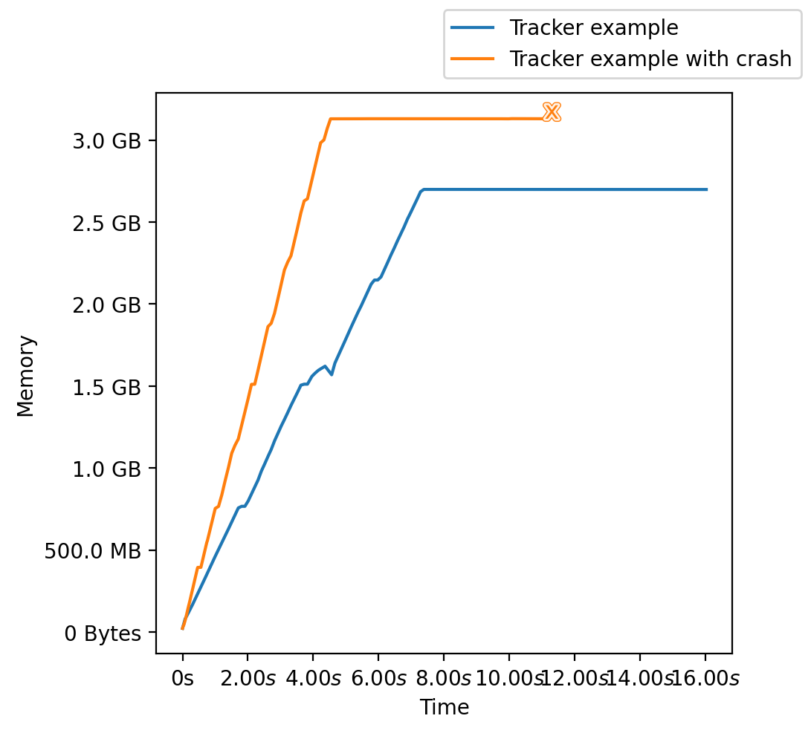

Memory Time Tracker
=================================
|pip| |downloads|

Memory time tracker is a simple python tool to track the memory and time requirements of software across both very brief (milliseconds) and large (days) time and memory requirements through adaptative log resolution.

The reports are CSV files with two columns, the first one with the time delta and the second one with the required RAM.

Tracking upwards to crash
------------------------------------
This package handles gracefully also use cases where the tracked software
dies because of OOM or generally crashes by adding a ``0,0`` as the last line of the CSV document
it produces when the execution finishes nominally while adding a ``-1,-1`` when the execution
finishes with a detectable exception. When there are crashes not detectable through exceptions,
such as machine freezes because of OOM, kernel panics or other things, neither ``0,0`` nor ``1,1`` are (inevitably) written at the end of the CSV.

To help distinguish the different possible completion statuses, we have prepared three methods:

* ``has_completed_successfully`` to detect whether the execution has been completed without hiccups.
* ``has_crashed_gracefully`` to detect crashes that raised "normal" exceptions.
* ``has_crashed_ungracefully`` to detect crashes that did not raise "normal" exceptions, such as OOM and core dumps.

See more below in the Examples section.

Requirements
----------------------------
Please do note that this package makes use of `proc/meminfo <https://man7.org/linux/man-pages/man5/proc.5.html>`_,
so it is strictly compatible only with Linux systems.

Like most tracker systems, this one works best if there is a limited amount of noise in the system.
Do not run other software while running the benchmark, or your results may be skewed.

Installing package
----------------------------
As usual, to install this package from Pypi, just run:

.. code:: bash

    pip install memory_time_tracker

Usage example
---------------------------
You can use this package to track the execution of a given method as follows:

.. code:: python

    from memory_time_tracker import Tracker, has_completed_successfully, has_crashed_gracefully, has_crashed_ungracefully, plot_reports
    from time import sleep
    import numpy as np

    def example_function():
        """Small example of function that takes 2 seconds."""
        arrays = []
        for _ in range(10):
            arrays.append(np.zeros((10000, 10000)))
            sleep(0.2)

    def example_function_which_crashes():
        """Small example of function that takes 2 seconds and crashes."""
        arrays = []
        for _ in range(20):
            arrays.append(np.zeros((10000, 5000)))
            sleep(0.1)
        raise ValueError("Argh! I'm crashig!")

    # The path where we will store the log
    path1 = "/tmp/tracker_example.csv"
    # The path where we will store the log with the crash
    path2 = "/tmp/tracker_example_with_crash.csv"

    # Create the tracker context
    with Tracker(path1):
        example_function()

    # Wait between tracking to allow for memory to free
    sleep(20)

    # Create the tracker context to handle crashable libraries
    try:
        with Tracker(path2, verbose=True):
            example_function_which_crashes()
    except Exception:
        pass

    print(
        "Successful: ", has_completed_successfully(path1),
        "Crashed gracefully: ", has_crashed_gracefully(path1),
        "Crashed ungracefully: ", has_crashed_ungracefully(path1)
    )
    # Successful:  True Crashed gracefully:  False Crashed ungracefully:  False

    print(
        "Successful: ", has_completed_successfully(path2),
        "Crashed gracefully: ", has_crashed_gracefully(path2),
        "Crashed ungracefully: ", has_crashed_ungracefully(path2)
    )
    # Successful:  False Crashed gracefully:  True Crashed ungracefully:  False  

    plot_reports([path1, path2])

You can `run it on Colab here <https://colab.research.google.com/drive/17RhQQyP8gmIb1qprQwOVPwut_mZgA01K?usp=sharing>`_.

The above example should generate a picture such as this one:

Note that there is some noise in the RAM and time measurements as it was executed on COLAB.

Authors and License
---------------------------
This package was developed by `Luca Cappelletti <https://github.com/LucaCappelletti94>`_ and `Tommaso Fontana <https://github.com/zommiommy>`_ and is released under `MIT License <https://github.com/LucaCappelletti94/memory_time_tracker/blob/main/LICENSE>`_.

.. |pip| image:: https://badge.fury.io/py/memory-time-tracker.svg
    :target: https://badge.fury.io/py/memory-time-tracker
    :alt: Pypi project

.. |downloads| image:: https://pepy.tech/badge/memory-time-tracker
    :target: https://pepy.tech/badge/memory-time-tracker
    :alt: Pypi total project downloads 